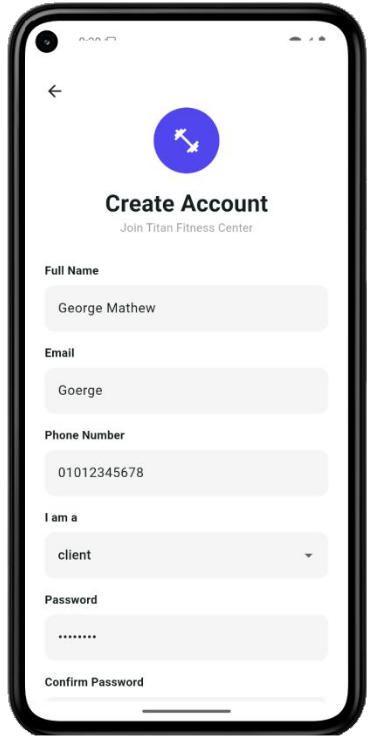
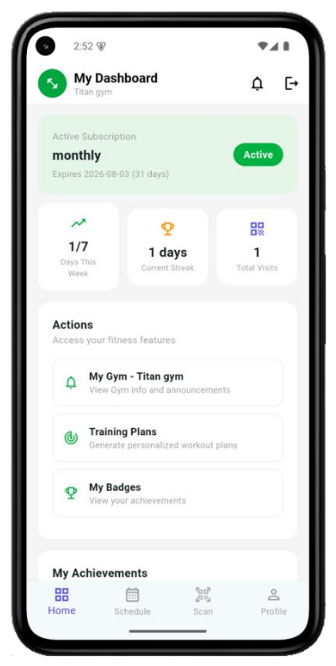
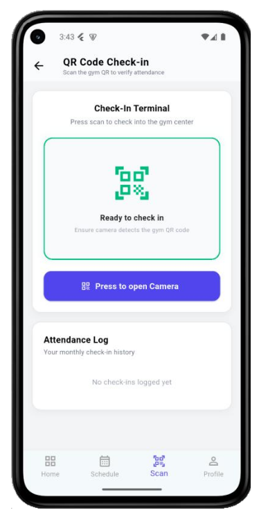

# 🏋️ Titan — Gym Community Management System

Titan is a mobile-first, role-based platform that digitizes day-to-day gym operations while building an interactive, AI-supported fitness experience for members. It brings gym administration, coaching, attendance, personalized training, and member-retention analytics into a single system for **admins**, **coaches**, and **clients**.

> Graduation Project — Cairo University, Faculty of Computing and Artificial Intelligence, Department of Computer Science (2025–2026)

---

## 📖 Table of Contents

- [About the Project](#about-the-project)
- [Key Features](#key-features)
- [Tech Stack](#tech-stack)
- [System Architecture](#system-architecture)
- [AI & Machine Learning](#ai--machine-learning)
- [Screenshots](#screenshots)
- [Getting Started](#getting-started)
- [Project Structure](#project-structure)
- [Testing](#testing)
- [Security](#security)
- [Limitations & Future Work](#limitations--future-work)
- [Team](#team)
- [License](#license)
- [References](#references)

---

## About the Project

Many gyms still run on manual processes or disconnected tools, leading to inefficient workflows, poor communication, and little personalization for members. **Titan** solves this with a single mobile platform that:

- Automates gym administration (memberships, subscriptions, attendance, scheduling, announcements).
- Enforces strict **role-based access control (RBAC)** for three user types — Admins, Coaches, and Clients.
- Generates **AI-personalized training plans** using an LLM agent.
- Predicts **member churn risk** with a trained ML model, feeding into a targeted retention-offer workflow.
- Encourages engagement through a **gamified badge system**.

---

## Key Features

### 🛠️ Administrator
- Multi-gym creation and management (machine inventory, hours, location).
- Client & coach invitations, membership activation/suspension, subscription tracking.
- Class approval workflow, capacity management, and scheduling oversight.
- Announcements targeted to clients, coaches, or both.
- Revenue, attendance, and membership analytics dashboard.
- AI-driven churn-risk dashboard with retention offer creation and recipient review.

### 🧑‍🏫 Coach
- Personalized cross-gym timetable.
- Class request workflow (add/update/remove), pending admin approval.
- Attendance visibility for assigned sessions.
- Gym-specific announcements and profile management.

### 🏃 Client
- Profile & fitness-goal management, gym enrollment.
- QR-code based gym check-in with subscription validation.
- Class browsing and enrollment with conflict/capacity checks.
- **AI-generated personalized training plans** (goal, level, duration, equipment-aware), exportable as PDF, with per-exercise progress tracking.
- Gamified **achievement badges** for attendance streaks and milestones.
- Gym community space and in-app/push notifications.

---

## Tech Stack

| Layer            | Technology                                              |
|-------------------|----------------------------------------------------------|
| Mobile Frontend   | Flutter (Dart) — single codebase for Android & iOS       |
| Backend           | FastAPI (Python), SQLAlchemy (async)                      |
| Database          | PostgreSQL, hosted on Supabase                            |
| Authentication    | JWT (HS256) + bcrypt password hashing                     |
| Push Notifications| Firebase Cloud Messaging (FCM)                             |
| AI / ML           | scikit-learn (Decision Tree churn model), Gemini API (training-plan generation) |
| Testing           | pytest, AsyncMock, Postman                                 |
| Tooling           | Git/GitHub, Figma, Draw.io, Linear                          |

---

## System Architecture

Titan follows a layered architecture:

```
Presentation Layer   → Flutter mobile app (Auth, Profiles, Timetable, QR Attendance, AI Plans, Analytics)
Application Layer    → FastAPI backend (Identity & RBAC, Membership & Billing, Scheduling,
                       Attendance, Churn Prediction, Retention Offers, Notifications)
Data Layer           → Supabase PostgreSQL (SQLAlchemy + Alembic migrations)
External Services    → Email provider, Firebase FCM, Google Gemini API
```

- **Security:** JWT authentication, RBAC, HS256 + HTTPS-only, bcrypt password hashing.
- **Performance targets:** <2s response time, 1,000+ concurrent users, <30s churn-prediction batch, ≥85% model accuracy.

---

## AI & Machine Learning

### Churn Prediction
- **Model:** Decision Tree Classifier (scikit-learn), 3-class output — `High` / `Mid` / `Low` risk.
- **Accuracy:** 88.5% on a held-out test set (3,200 train / 800 test, stratified split).
- **Features:** 12 weeks of bucketed attendance levels plus 7 engineered statistics (weighted recency score, days since last visit, days until subscription expiry, etc.).
- **Training data:** Built from the public [Gym Customers Features & Churn](https://www.kaggle.com/datasets/adrianvinueza/gym-customers-features-and-churn) Kaggle dataset, with a custom Poisson-based simulation to reconstruct weekly attendance patterns.
- **Serving:** Predictions run on-demand per gym via `GET /retention/dashboard/{gym_id}`, feeding the admin retention-offer workflow. Predictions are **advisory only** — no action is taken without admin approval.

### Personalized Training Plans
- Uses the **Gemini API** as an LLM agent to generate multi-week, equipment-aware workout plans from a client's goal, level, and availability — rather than static templates.
- Supports progress tracking at the day/week/plan level, auto-completion, and PDF export.

---

## Screenshots

> Add your app screenshots here, e.g.:
>
> | Sign Up | Client Dashboard | QR Check-in |
> |---|---|---|
> |  |  |  |

---

## Getting Started

### Prerequisites
- Python 3.11+
- Flutter SDK (3.x) with Android/iOS toolchains
- A Supabase project (PostgreSQL) or local PostgreSQL instance
- Firebase project (for push notifications)
- A Google Gemini API key (for AI training plans)

### Backend Setup

```bash
# Clone the repo
git clone https://github.com/shaza2407/Titan_Gym-Mangement-Application.git
cd Titan_Gym-Mangement-Application/backend

# Create and activate a virtual environment
python -m venv venv
source venv/bin/activate  # Windows: venv\Scripts\activate

# Install dependencies
pip install -r requirements.txt

# Configure environment variables
cp .env.example .env
# then fill in: DATABASE_URL, JWT_SECRET, FIREBASE credentials, GEMINI_API_KEY, SMTP settings

# Run database migrations
alembic upgrade head

# Start the API server
uvicorn app.main:app --reload
```

### Frontend Setup

```bash
cd ../frontend

# Install dependencies
flutter pub get

# Point the app at your backend base URL (see lib/config or .env)

# Run on a connected device/emulator
flutter run
```

---

## Project Structure

```
Titan_Gym-Mangement-Application/
├── backend/
│   ├── app/
│   │   ├── models/          # SQLAlchemy models
│   │   ├── schemas/         # Pydantic schemas
│   │   ├── services/        # Business logic (admin, client, coach, ML, notifications)
│   │   ├── routers/         # FastAPI route definitions
│   │   └── main.py
│   ├── ml/                  # Churn prediction: training scripts + saved artifacts (.pkl)
│   ├── tests/                # pytest unit tests
│   └── alembic/              # Database migrations
├── frontend/
│   └── lib/
│       ├── screens/          # Admin / Coach / Client UI
│       ├── services/         # API client, auth, caching
│       └── widgets/
└── docs/                     # Diagrams, ERD, mockups, reports, screenshots
```

---

## Testing

- **612 unit tests** (pytest + AsyncMock) covering admin, auth, client, coach, ML, and notification services — 100% pass rate.
- **Postman collection** covering every REST endpoint (auth, admin, client, coach flows), verified against a live backend.
- **Performance profiling** via Chrome DevTools across core user journeys — most API requests complete in under 2 seconds.

Run the backend test suite:
```bash
cd backend
pytest
```

---

## Security

- JWT (HS256) authentication with bcrypt-hashed passwords.
- Role-Based Access Control enforced at the API layer for Admin / Coach / Client.
- Email verification and password-reset flows via signed, time-limited tokens.
- QR-based attendance validated server-side against membership status to prevent forged or duplicate check-ins.
- Sensitive configuration kept in `.env`, excluded from version control.

---

## Limitations & Future Work

- No payment integration yet — subscriptions are managed by admins.
- No wearable-device integration.
- No CI/CD pipeline or containerization (Docker) yet.
- No formal load/concurrency testing (current benchmarks are single-user, client-side profiling).

Planned: payment gateway integration, wearable support, Docker + CI/CD, hosted deployment, and load testing.

---

## Team

Built by a team of five Computer Science students at Cairo University, under the supervision of **Dr. Manar Elkady** and **TA. Nourhan Atef**:

- Shaza Ahmed Mohamed Wagdy
- Ahmed Ashraf Attia Mabrouk
- Aisha Ibrahim Abdulsalam Kotb
- Rania Rafat Edwar
- Abdullah Mohamed Abdullah Mohamed

---

## License

This project was developed as an academic graduation project.

---

## References

- [Gym Customers Features & Churn — Kaggle](https://www.kaggle.com/datasets/adrianvinueza/gym-customers-features-and-churn)
- [FastAPI Documentation](https://fastapi.tiangolo.com/)
- [Flutter Documentation](https://docs.flutter.dev/)
- [Supabase Documentation](https://supabase.com/docs)
- [Google Gemini API](https://ai.google.dev/gemini-api/docs/api-key)